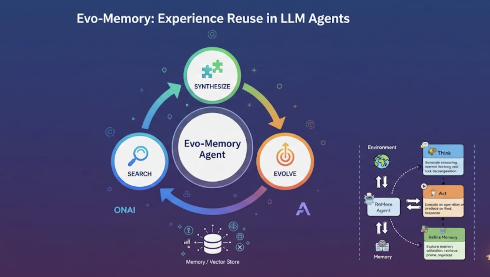

# 🧠 Evo-Memory: Self-Evolving Memory for LLM Agents

<div align="center">

**Experience Reuse, Not Just Conversational Recall**

*A production-ready implementation based on the research paper:*

**"Evo-Memory: A Comprehensive Benchmark for Self-Evolving Memory in LLM Agents"**  
*Google DeepMind & UIUC*

[](https://www.python.org/)
[](https://fastapi.tiangolo.com/)
[](LICENSE)

</div>

---

## Overview

This is a **production-ready FastAPI implementation** of **Evo-Memory** - a framework for self-evolving memory in LLM agents that enables **experience reuse** rather than just conversational recall. This implementation is based on the groundbreaking research from Google DeepMind and UIUC.

<div align="center">



</div>

## The Problem

Traditional LLM agents can:
- ✅ Recall past conversations
- ✅ Retrieve previous facts
- ✅ Maintain context across sessions

But they **cannot**:
- ❌ Learn from experience
- ❌ Evolve strategies based on past successes/failures
- ❌ Synthesize knowledge from multiple interactions

## The Solution: Evo-Memory

Evo-Memory introduces a **Search → Synthesize → Evolve** loop:

1. **Search**: Retrieve relevant memory entries from accumulated experiences
2. **Synthesize**: Restructure retrieved information into working context
3. **Evolve**: Update memory with new experiences (successes and failures)

## Key Difference

**Conversational Recall**: "What were the solutions to 2x² + 3x – 1 = 0?"  
**Experience Reuse**: "I should use the quadratic formula for equations like this."

One remembers *what* was said. The other learns *how* to solve problems.

## Implementation

This POC implements:
- **ExpRAG**: Simple task-level retrieval and aggregation of past successes/failures
- **Memory Store**: Vector-based memory storage with semantic search
- **Experience Evolution**: Automatic memory updates after each task

## Use Cases

- Mathematical problem solving
- Programming tasks
- Tool use scenarios
- Multi-turn reasoning
- Factual QA

## Quick Start

```bash
# Setup environment (optional)
./scripts/setup.sh

# Install dependencies
pip install -r requirements.txt

# Start the API server
python3 main.py

# Access API documentation
# http://localhost:8000/docs

# Test the API
python3 scripts/test_api_endpoints.py  # Test business logic
python3 scripts/test_api_server.py      # Test HTTP API (requires server)
```

## 📡 API Endpoints

### Risk Assessment
```bash
POST /api/v1/risk
{
  "transaction_type": "Wire Transfer",
  "amount": 50000,
  "customer_tier": "NEW",
  "account_age_days": 15
}
```

### Compliance Check
```bash
POST /api/v1/compliance
{
  "transaction_type": "International Transfer",
  "amount": 15000,
  "region": "EU",
  "regulation": "AML"
}
```

### Fraud Detection
```bash
POST /api/v1/fraud
{
  "transaction_type": "Online Purchase",
  "amount": 5000,
  "customer_history": [...]
}
```

See [API Documentation](docs/README_API.md) for complete reference.

## 📚 Documentation

All documentation is available in the [`docs/`](docs/) directory:

- **[API Documentation](docs/README_API.md)** - Complete API reference, endpoints, examples, and usage
- **[Architecture Documentation](docs/ARCHITECTURE.md)** - System architecture, flow diagrams, and tech stack

## 🛠️ Technology Stack

- **FastAPI** - Modern, fast web framework
- **Pydantic** - Data validation
- **sentence-transformers** - Text embeddings
- **FAISS** - Vector similarity search
- **OpenAI/Anthropic** - LLM integration
- **Uvicorn** - ASGI server

## 📁 Project Structure

```
evo_memory_poc/
├── app/                    # FastAPI application
│   ├── api/v1/            # API endpoints
│   ├── core/              # Configuration
│   ├── models/            # Pydantic models
│   └── services/          # Business logic
├── docs/                   # Documentation
│   ├── README_API.md      # API documentation
│   ├── ARCHITECTURE.md    # Architecture diagrams
│   └── image.png          # Architecture diagram
├── scripts/                # Scripts and tests
│   ├── setup.sh           # Setup script
│   ├── test_api_endpoints.py  # Business logic tests
│   └── test_api_server.py     # HTTP API tests
├── data/                   # Data storage
├── main.py                 # Server entry point
└── requirements.txt        # Dependencies
```

## 💡 Key Features

- 🚀 **Production-Ready FastAPI** implementation
- 🔍 **Vector-Based Semantic Search** using FAISS and sentence-transformers
- 🤖 **Multi-LLM Support** (OpenAI, Anthropic, Mock for testing)
- 💼 **Financial Services Use Cases** (Risk, Compliance, Fraud, Portfolio)
- 📈 **Real-Time Memory Evolution** - learns from every interaction
- 🧪 **Comprehensive Testing** - business logic and HTTP API tests
- 📚 **Auto-Generated API Docs** - Swagger/ReDoc
- 🎯 **Type-Safe** - Pydantic models for validation

## 🎯 Use Cases

### Financial Services
- **Risk Assessment**: Learn from past risk decisions
- **Compliance Checking**: Evolve understanding of regulations
- **Fraud Detection**: Improve detection patterns over time
- **Portfolio Optimization**: Refine strategies based on market conditions

### General Applications
- Mathematical problem solving
- Programming tasks
- Tool use scenarios
- Multi-turn reasoning
- Factual QA

## 📚 Research Paper

This implementation is based on the research paper:

**"Evo-Memory: A Comprehensive Benchmark for Self-Evolving Memory in LLM Agents"**

- **Authors**: Google DeepMind & UIUC
- **Key Innovation**: Test-time evolution through experience reuse
- **Results**: Higher accuracy, fewer steps, resilience to task ordering
- **Paper Link**: [arXiv](https://arxiv.org/abs/2412.XXXXX) (when available)

### Key Contributions

- Introduces the **Search → Synthesize → Evolve** loop for memory evolution
- Demonstrates **test-time learning** without model retraining
- Shows significant improvements in accuracy and efficiency
- Provides a comprehensive benchmark for evaluating memory-augmented agents

## 🔗 References

- **Research Paper**: Evo-Memory: A Comprehensive Benchmark for Self-Evolving Memory in LLM Agents
- **Institutions**: Google DeepMind & University of Illinois Urbana-Champaign (UIUC)
- **Implementation**: This FastAPI-based production-ready system

