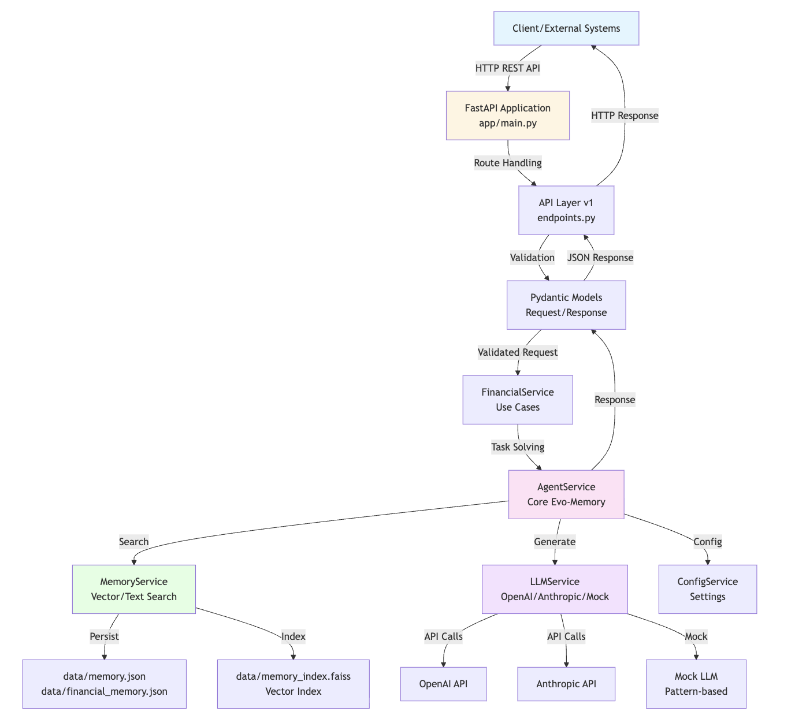

# Evo-Memory Financial Services API: Architecture Diagram

## 🎨 Complete System Architecture Diagram

The following diagram illustrates the complete request-response flow, showing how external clients interact with the system through the API layer, how services orchestrate tasks, and how data flows through memory storage and LLM services.



*Complete system architecture showing request flow, service interactions, and data persistence.*

```

## 🔧 Component Interaction Diagram

```
┌─────────────────────────────────────────────────────────────────┐
│                         API Endpoints                            │
│  ┌──────────┐  ┌──────────┐  ┌──────────┐  ┌──────────┐        │
│  │  /solve  │  │  /risk   │  │/compliance│  │  /fraud  │        │
│  └────┬─────┘  └────┬─────┘  └────┬─────┘  └────┬─────┘        │
│       │             │             │             │               │
│       └─────────────┴─────────────┴─────────────┘               │
│                          │                                       │
│                          ▼                                       │
│              ┌───────────────────────┐                          │
│              │  FinancialService     │                          │
│              │  (Use Case Layer)    │                          │
│              └───────────┬───────────┘                          │
│                          │                                       │
│                          ▼                                       │
│              ┌───────────────────────┐                          │
│              │  AgentService         │                          │
│              │  (Core Logic)         │                          │
│              └───────────┬───────────┘                          │
│                          │                                       │
│        ┌─────────────────┼─────────────────┐                   │
│        │                 │                 │                   │
│        ▼                 ▼                 ▼                   │
│  ┌──────────┐    ┌──────────┐    ┌──────────┐                 │
│  │  Memory  │    │   LLM    │    │  Config  │                 │
│  │ Service  │    │ Service  │    │ Service  │                 │
│  └────┬─────┘    └────┬─────┘    └────┬─────┘                 │
│       │              │                 │                        │
│       │              │                 │                        │
│       ▼              ▼                 ▼                        │
│  ┌──────────┐  ┌──────────┐    ┌──────────┐                  │
│  │  FAISS   │  │ OpenAI/  │    │  .env    │                  │
│  │  Index   │  │Anthropic │    │  Files   │                  │
│  └──────────┘  └──────────┘    └──────────┘                  │
│       │                                                         │
│       ▼                                                         │
│  ┌──────────┐                                                  │
│  │  JSON    │                                                  │
│  │  Files   │                                                  │
│  └──────────┘                                                  │
└─────────────────────────────────────────────────────────────────┘
```

## 📦 Technology Stack Summary

| Layer | Technology | Purpose | Version |
|-------|-----------|---------|---------|
| **Web Framework** | FastAPI | REST API framework | 0.100+ |
| **ASGI Server** | Uvicorn | High-performance server | 0.20+ |
| **Validation** | Pydantic | Request/response validation | 2.0+ |
| **LLM Provider** | OpenAI | GPT models | 1.0+ |
| **LLM Provider** | Anthropic | Claude models | 0.7+ |
| **Vector Search** | sentence-transformers | Text embeddings | 2.2+ |
| **Vector DB** | FAISS | Similarity search | 1.7+ |
| **Data Processing** | NumPy | Numerical operations | 1.24+ |
| **HTTP Client** | Requests | API testing | 2.31+ |
| **Config** | python-dotenv | Environment variables | 1.0+ |

## 🎯 Key Features & Capabilities

1. **Experience Reuse**: Learns from past successes and failures
2. **Semantic Search**: Vector-based similarity search for relevant memories
3. **Memory Evolution**: Automatically updates memory after each task
4. **Type Safety**: Pydantic models ensure data validation
5. **API Documentation**: Auto-generated Swagger/ReDoc docs
6. **Mock Mode**: Works without API keys for testing
7. **Fallback Support**: Text search when vector dependencies unavailable
8. **Financial Use Cases**: Specialized endpoints for finance
9. **Scalable**: FAISS supports millions of vectors
10. **Production Ready**: Clean architecture, error handling, logging

## 🔐 Security & Configuration

- Environment variables for sensitive data (API keys)
- CORS middleware for cross-origin requests
- Request validation prevents invalid data
- Error handling with proper HTTP status codes
- Optional authentication (can be added)

## 📈 Scalability Considerations

- **Memory**: FAISS index scales to millions of vectors
- **API**: FastAPI async support for high concurrency
- **Storage**: JSON files can be migrated to databases
- **LLM**: Supports multiple providers for redundancy
- **Caching**: Can add Redis for frequently accessed memories

